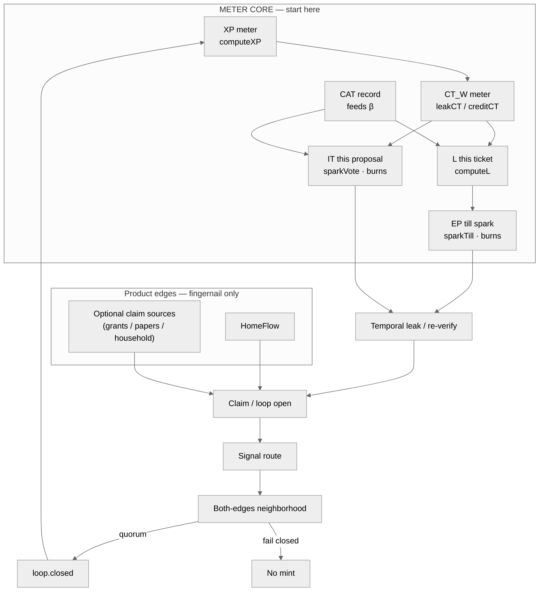

# Extropy Engine Architecture (meter-first)

> **Center:** CT · EP · L · CAT · IT (+ XP mint).
> **Edges only:** HomeFlow, GrantFlow, academia-bridge. Do not lead diagrams with grants or papers.

Canonical math: `packages/xp-formula`. Facade: `packages/meters` (`@extropy/meters`).

Full write-up: [`docs/architecture/METER_CORE.md`](docs/architecture/METER_CORE.md)

## Rules for any generated diagram

1. Meters first: label **CT, EP, L, CAT, IT, XP** on the main path.
2. Fail-closed: no quorum / reject / missing both-edges-sign → **no mint**.
3. Never draw GrantFlow / academia as the center or as half the chart.
4. DT is not a bag — do not mint DT.
