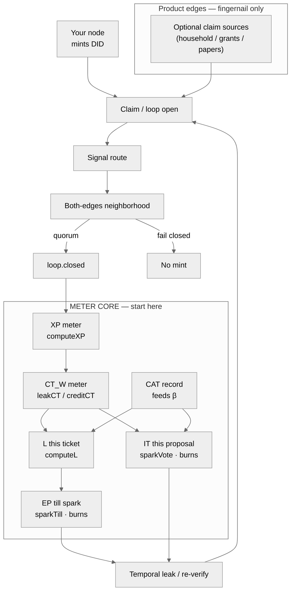

# Extropy Engine Architecture (meter-first)

> **Center:** CT · EP · L · CAT · IT (+ XP mint).
> **Identity:** DID minted by **your own node** when you install and set it up. No Google Auth. No KYC. No central customer registry.
> **Edges only:** HomeFlow, GrantFlow, academia-bridge — example claim paths, not the product. Do not lead diagrams with grants, papers, or OAuth.

Canonical math: `packages/xp-formula`. Facade: `packages/meters` (`@extropy/meters`).

Identity rule: [`docs/architecture/IDENTITY.md`](docs/architecture/IDENTITY.md)
Full meter write-up: [`docs/architecture/METER_CORE.md`](docs/architecture/METER_CORE.md)
Diagram source: [`DIAGRAM.md`](DIAGRAM.md)

## Identity (non-negotiable)

1. The only protocol identity is the **DID created when you download and stand up your own node**.
2. There is **no** Google Auth, Apple login, KYC vendor, or central user registry for the protocol.
3. There is **no** central hub that runs Extropy Engine for everyone. Nodes verify closed loops. Standing lives on meters.
4. If you lose your DID and did not back it up, **you start over**. That is the design.
5. **CAT** is a skill record (lane credential), not a login credential and not KYC.

Leftover HomeFlow Google OAuth in changelog/scaffold is **edge debt** — remove it; do not treat it as architecture.

## Rules for any generated diagram

1. Meters first: label **CT, EP, L, CAT, IT, XP** on the main path.
2. Show **node → DID** as identity. Never draw Google Auth / KYC / customer registry as the identity layer.
3. Fail-closed: no quorum / reject / missing both-edges-sign → **no mint**.
4. Never draw GrantFlow / academia as the center or as half the chart.
5. DT is not a bag — do not mint DT.
