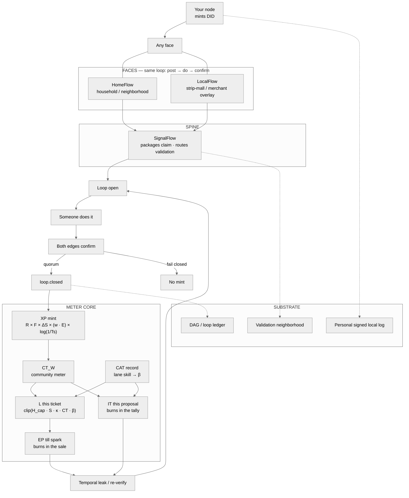

# Extropy Engine Architecture

> **Spine:** SignalFlow packages every claim and routes validation.
> **Center:** meters CT · EP · L · CAT · IT (+ XP mint).
> **Identity:** DID minted by **your own node** at install. No Google Auth. No KYC. No central customer registry.
> **Faces (same loop):** HomeFlow (household) · LocalFlow (neighborhood / strip-mall / merchant). Same product everywhere: post → do → confirm.
> **Not the product:** GrantFlow / academia demos are optional footnotes only — never center, never multiple boxes, omit from diagrams if they steal weight.

Canon: Codex v2.1 · formula canonical-v3.12 · [extropyengine.com](https://extropyengine.com) · `packages/xp-formula` · `@extropy/meters`.

Identity: [`docs/architecture/IDENTITY.md`](docs/architecture/IDENTITY.md)  
Meters: [`docs/architecture/METER_CORE.md`](docs/architecture/METER_CORE.md)  
Diagram source: [`DIAGRAM.md`](DIAGRAM.md) · rules: [`docs/architecture/DIAGRAM_RULES.md`](docs/architecture/DIAGRAM_RULES.md)

## What the product is

You post a need. Someone nearby does it. You tap done. Confirmation is the receipt. That loop is the whole app ([extropyengine.com](https://extropyengine.com)).

SignalFlow is how the claim enters the protocol and how validation is routed. The kernel mints only after the loop closes both-edges-sign. Fail closed: no quorum / reject / missing signature → **no mint**.

## System map (draw this)

## Layers

| Layer | What lives here | What does not |
|---|---|---|
| **Faces** | HomeFlow, LocalFlow — UX for the same loop | Separate “apps” that invent their own mint |
| **Spine** | SignalFlow — claim package + validator routing | Grant proposers as protocol core |
| **Meters** | CT, EP, L, CAT, IT, XP | Bags / cash-out / DT mint |
| **Substrate** | DAG ledger, validation neighborhoods, PSLL, temporal leak | Central customer DB |
| **Identity** | Node-minted DID | Google / Apple / KYC / registry |

## LocalFlow (merchant / strip)

LocalFlow is the neighborhood business face: cash still clears; the overlay runs beside the register as a check while the DAG learns. Absorption is ρ climbing, not a launch date. Merchant settlement uses EP (emergence / till spark) bounded to in-network benefit — never a fiat bridge.

## HomeFlow (household)

HomeFlow is the household / neighborhood chore and favor face. Same loop: post, do, confirm. Same SignalFlow package. Same meters.

## SignalFlow (spine)

SignalFlow packages the claim and routes validation (domain × standing × load × accuracy → neighborhood). It is not “another app beside HomeFlow.” It is how every face talks to the kernel.

## Identity (non-negotiable)

1. Protocol identity = DID created when you stand up **your own node**.
2. No Google Auth, Apple login, KYC vendor, or central user registry.
3. No central hub that runs Extropy for everyone. Nodes verify closed loops. Standing lives on meters.
4. Lose the DID without backup → start over.
5. **CAT** is a skill record (lane credential), not login and not KYC.

## Rules for any generated diagram

1. Draw **SignalFlow** as the only router between faces and meters.
2. Label **CT, EP, L, CAT, IT, XP** on the main path.
3. Show **HomeFlow** and **LocalFlow** as faces — equal weight, thin edges into SignalFlow.
4. Show **node → DID** as identity.
5. Fail-closed path must be visible.
6. **Do not** draw GrantFlow, Grants.gov, academia, or papers as center or as multiple boxes. Prefer omit.
7. **Do not** mint DT. Do not draw EP/IT as wallet piles.
