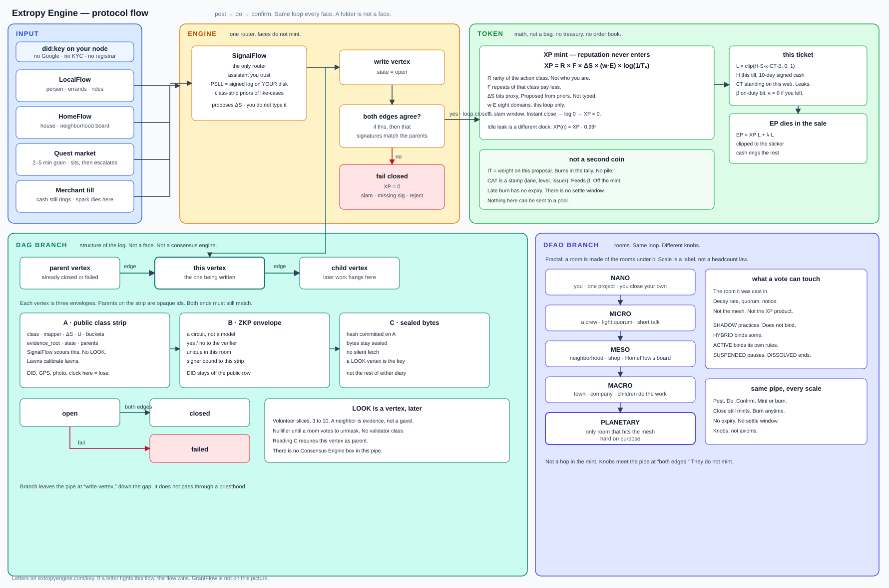
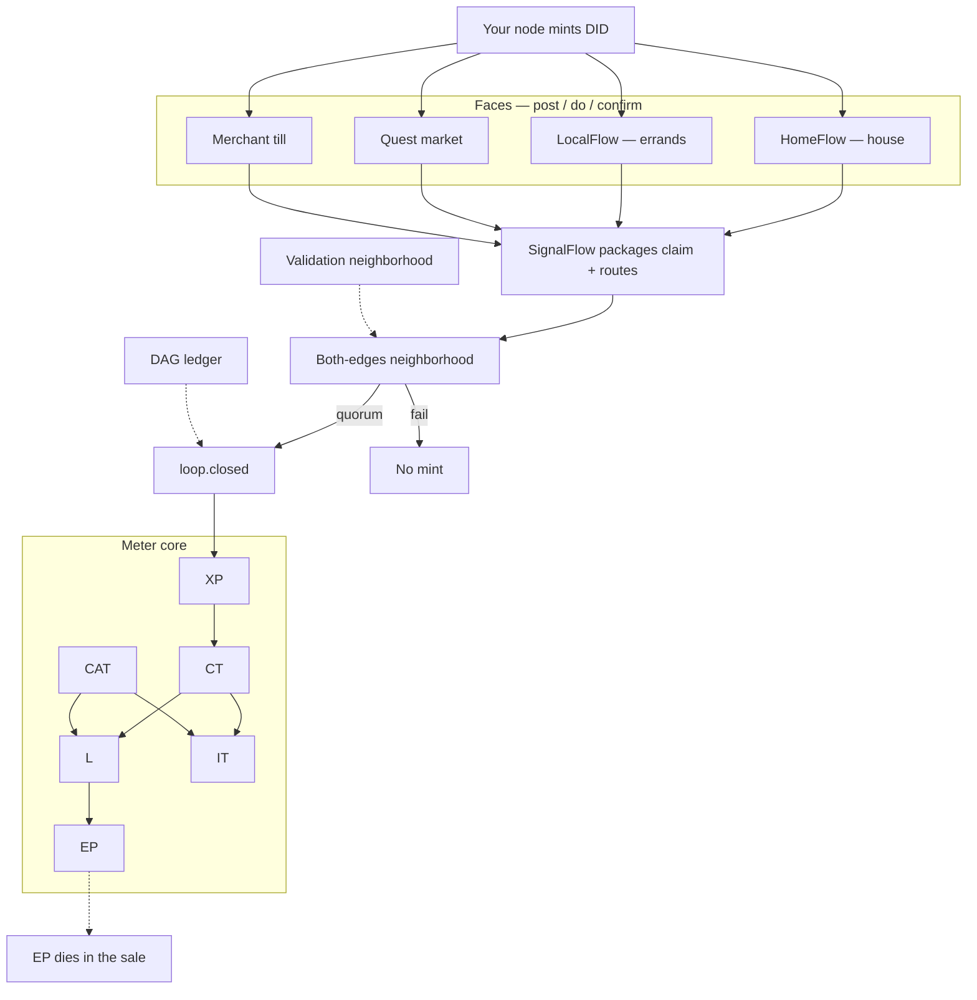

# Extropy Engine — canonical architecture diagram

**This file is the architecture diagram source.** Regenerators must follow it and `docs/architecture/DIAGRAM_RULES.md`.

Locked picture: [`docs/architecture/engine.svg`](docs/architecture/engine.svg)

Grounding: [extropyengine.com](https://extropyengine.com) · Codex v2.1 · Meter Core.

## Center (always draw)

| Object | Role |
|---|---|
| **DID** | Minted by **your node** at setup. Only protocol identity. |
| **SignalFlow** | Packages the claim; routes validation. The spine. |
| **XP** | Minted only after loop close with verified ΔS |
| **CT** | Community meter on web W; feeds L and IT |
| **L** | This-ticket math — not a bag |
| **EP** | Till spark — burns in the sale |
| **CAT** | Skill record `(DID, lane, level, issuer)` — feeds β |
| **IT** | This-proposal spark — burns in the tally |

## Faces (always draw, equal weight)

| Face | Role |
|---|---|
| **HomeFlow** | Household / neighborhood loops |
| **LocalFlow** | Person / errands — rides, groceries, the car you don’t have |
| **Quest market** | 2–5 minute grain |
| **Merchant till** | Strip mall. Cash still rings. EP dies in the sale |

Same loop on every face: **post → do → confirm**.

## Mermaid (copy this)

## If someone is grading a getdiagram spider

That spider is not this file. Answers they keep asking:

1. **CT.** Community standing on web W. Same number at compatible tills. Feeds L and IT. Never enters the XP product. `L = clip(H_cap · S · κ · CT_W · β, 0, 1)`. `EP = XP · L + λ · L`, clip to list, dies in the sale. Not `min(..., line × H_cap)` — H_cap is already inside L. R in the mint is rarity of the action class, not reputation.
2. **No Consensus Engine.** Close is a state: both edges, volunteer LOOK slices, fail closed. A neighbor is evidence, not a gavel. Looking writes a vertex. There is no validator class and no package with that name.
3. **No civic sidecar.** Neighborhood board is HomeFlow’s MESO skin. Color in a generated chart is not build status.
4. **PSLL** = Personal Signed Local Log. Append-only file on your disk. Merkle-anchored. Not the public class strip.

The running product is post → do → confirm. This picture is the map. Essays are not the destination.

## Do not

- Do not inventory `packages/`. A folder is not a face.
- Do not draw Google Auth, OAuth, KYC, or a customer registry as identity.
- Do not treat faces as separate protocols — they sit on SignalFlow.
- Do not mint DT.
- Do not draw EP or IT as wallet piles.

## Full-board checklist (complete system)

A complete board includes all of: node DID · LocalFlow · HomeFlow · quest market · merchant till · SignalFlow · post/do/confirm · both-edges verify · fail-closed · XP mint formula · CT · L · EP · CAT · IT · temporal leak · DAG ledger · validation neighborhood · PSLL.
