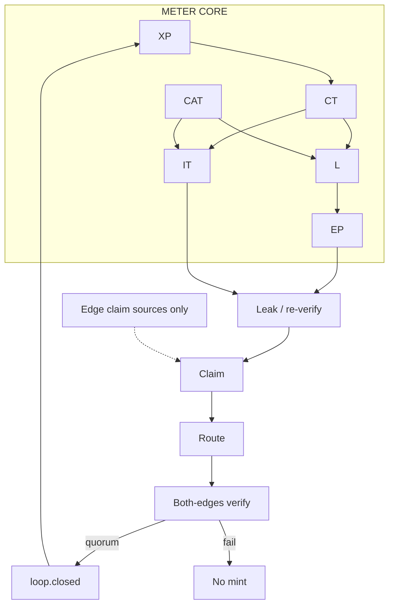

# Extropy Engine — canonical architecture diagram

**This file is the architecture diagram source.** Regenerators must follow it.

## Center (always draw these)

| Meter / object | Role |
|---|---|
| **XP** | Minted only after loop close with verified ΔS |
| **CT** | Community meter on web W; feeds L and IT |
| **L** | This-ticket math `clip(H_cap · S · κ · CT · β, 0, 1)` — not a bag |
| **EP** | Till spark `XP · L + λ · L` — burns in the sale |
| **CAT** | Skill record `(DID, lane, level, issuer)` — feeds β |
| **IT** | This-proposal spark — burns in the tally |

## Mermaid (copy this)

## Do not

- Do not center GrantFlow, Grants.gov, academia, or papers.
- Do not mint DT.
- Do not draw EP or IT as wallet piles.

Full rules: `docs/architecture/DIAGRAM_RULES.md` · `ARCHITECTURE.md` · `docs/architecture/METER_CORE.md`
