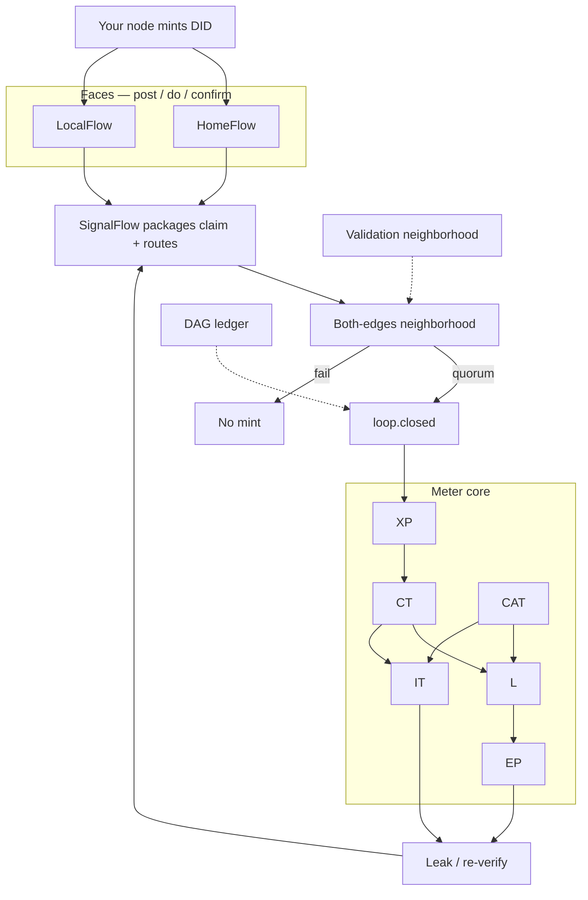

# Extropy Engine — canonical architecture diagram

**This file is the architecture diagram source.** Regenerators must follow it and `docs/architecture/DIAGRAM_RULES.md`.

Grounding: [extropyengine.com](https://extropyengine.com) · Codex v2.1 · Meter Core.

## Center (always draw)

| Object | Role |
|---|---|
| **DID** | Minted by **your node** at setup. Only protocol identity. |
| **SignalFlow** | Packages the claim; routes validation. The spine. |
| **XP** | Minted only after loop close with verified ΔS |
| **CT** | Community meter on web W; feeds L and IT |
| **L** | This-ticket math — not a bag |
| **EP** | Till spark — burns in the sale |
| **CAT** | Skill record `(DID, lane, level, issuer)` — feeds β |
| **IT** | This-proposal spark — burns in the tally |

## Faces (always draw, equal weight)

| Face | Role |
|---|---|
| **HomeFlow** | Household / neighborhood loops |
| **LocalFlow** | Strip-mall / merchant overlay (cash clears; protocol beside it) |

Same loop on every face: **post → do → confirm**.

## Mermaid (copy this)

## Do not

- Do not center or multiply GrantFlow / grants / academia / papers.
- Do not draw Google Auth, OAuth, KYC, or a customer registry as identity.
- Do not treat HomeFlow or LocalFlow as separate protocols — they are faces on SignalFlow.
- Do not mint DT.
- Do not draw EP or IT as wallet piles.

## Full-board checklist (complete system)

A complete board includes all of: node DID · HomeFlow · LocalFlow · SignalFlow · post/do/confirm · both-edges verify · fail-closed · XP mint formula · CT · L · EP · CAT · IT · temporal leak · DAG ledger · validation neighborhood · PSLL. If GrantFlow appears at all, it is one tiny footnote — prefer absent.
