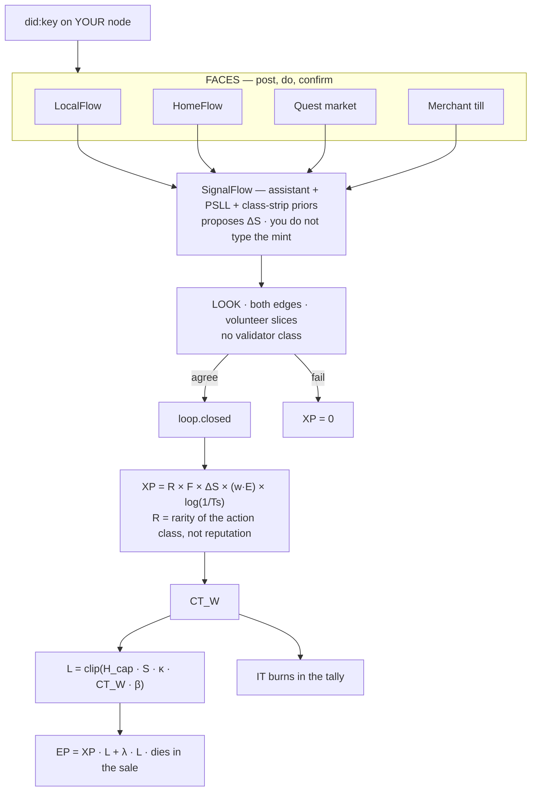

> **Canonical mint labels.** R is rarity of the action class. F is Frequency of Decay. ΔS is a bits-equivalent proxy, not XP. Tₛ is the slam window, not the 0.99ⁿ leak. L is this ticket. EP is the till spark (`EP = XP · L + λ · L`) and burns in the sale. Engineering spec: [`docs/SPEC_v3.5.md`](docs/SPEC_v3.5.md) (v3.5, 2026-09-11). Public PDF: https://extropyengine.com/docs/extropy-engine-technical-docs-v3.5.pdf. Codex v2.1 stays signed. Public letter key: https://extropyengine.com/key — meter math: https://extropyengine.com/docs/METER-MATH.md — gaps: https://extropyengine.com/open-problems
>
> Codex v2.1 stays signed. Code mint lives here in `packages/xp-formula` (`FORMULA_VERSION` still `canonical-v3.1.2`). If this README and the letter key disagree on names, the key wins. If this README and SPEC 3.5 disagree on meters, 3.5 wins.
>
> **Architecture for notebooks / getdiagram:** [`DIAGRAM.md`](DIAGRAM.md) · [`diagram.mmd`](diagram.mmd) · [`llms.txt`](llms.txt). Do not inventory `packages/`.

# Extropy Engine

A value-accounting protocol. Standing comes from a closed loop with a declared boundary. You cannot sell that standing.

ΔS is a bits-equivalent **proxy** so eight domain-native measurements can sit on one graph. It is not SI social heat. Landauer is a conversion floor for erased information, not a license to add a lawn to a heat bath.

House rule: we do not play their markets. No offset registry. No transferable tonne. No cash-out.

---

## The Claim

Useful work is a drop in disorder you can put evidence under and argue with later. The Engine is the audit loop for that claim: both edges, a versioned mapper, provisional mint, late burn, leak.

Honest contribution is cheaper than farming a bag because there is no bag.

---

## Canonical Formulas

### XP — minted on every closed loop with verified ΔS > 0

```
XP = R × F × ΔS × (w · E) × log(1/Tₛ)
```

| Variable | Range | Description |
|---|---|---|
| R | [0.1, 10.0] | **Rarity** multiplier. Action-class scarcity / base difficulty. Property of the loop, NOT the actor. Reputation does not enter here. |
| F | (0, 1] | **Frequency-of-decay** penalty. Diminishing returns for repeated instances of this action class. |
| ΔS | (0, ∞) | Verified entropy reduction. Must be > 0 to mint. |
| w · E | dot product | Weight vector × effort vector across energy dimensions |
| Tₛ | (0, 1] | Slam window: `exp(-λ min(Δt, Δt_cap))`. Instant close → log = 0 → XP = 0. Not recency. Not the standing leak. |

`log(1/Tₛ)` zeros a slam-shut script. F eats repeats. Standing leak is a different clock: `0.99ⁿ`.

**Why R is rarity, not reputation.** Every mint multiplier describes the loop. Actor history in R is reputation laundering. Vote weight and door-local CT are other meters.

Defaults and who may change them: [`docs/DEFAULTS.md`](docs/DEFAULTS.md).


### CT, L, EP — community meter, house cap, this person, this ticket

CT_W is community standing. Same readout at grocery and laundry if they still speak base CT. The door does not own CT.

H_cap — this till this window. Auto from signed cash. Training remainder 0 for 10 days (two 5-day weeks). No slider.
S — this person at this house.
β — CAT / on-duty proof this ticket. Not a wrap.
κ — 1 on the language. 0 if they left it.

```
L  = clip(H_cap · S · κ · CT_W · β, 0, 1)
EP = XP · L + λ · L
```

λ is small so leaked XP cannot erase a real local L. Clip EP to the list. Burns in that sale. Official skins show cash collected and the remainder, not raw XP.


### Ledger objects (five meters, not a six-token bag)

Public copy uses **record / meter / till spark**. The crowd hears “token” and reaches for Ethereum. Drop it.

| Object | Kind | Job |
|---|---|---|
| XP | Meter | Standing from verified ΔS. Non-transferable. Leaks `0.99ⁿ`. |
| CT | Meter | Community standing on web W. Same readout at compatible tills. |
| L | Meter | Local rank in `[0, 1]`. |
| EP | Till spark | `EP = XP · L + λ · L`. Born and burned in the sale. |
| CAT | Record | Skill credential in a **lane**. Unique. `(DID, lane, level, issuer)`. |
| IT | This proposal | clip(H_gov · S_gov · κ · CT_W · β_gov, 0, 1). Burns in the tally. |
| Domain | Enum | Eight entropy instruments. Not minted. |
| Lane | Field | Skill specialization. Claim is a signed vertex, not a dropdown. |

**DT is not a bag.** Old copy said Domain Token or Decay Token. Expertise is CAT-per-lane. The leak is already on XP. If the letter survives it is a unique lane-claim record, contestable, non-transferable. `TokenType.DT` in the wallet is leftover — remove it.

Five meters. Math letters are on https://extropyengine.com/math. Six was accretion. Do not grow a sixth bag.


The split exists so standing cannot buy votes and a skill stamp cannot print XP. See [`docs/CODEX_3_NOTES.md`](docs/CODEX_3_NOTES.md).

---

## Architecture

**Meter-first.** Closed-loop meters. Faces are seats of the same loop, not extra religions.

**Generators / Notebook LM:** copy [`DIAGRAM.md`](DIAGRAM.md) and [`diagram.mmd`](diagram.mmd). Picture: [`docs/architecture/engine.svg`](docs/architecture/engine.svg). Do not inventory `packages/`. A folder is not a face.

**Faces:** LocalFlow (person / errands) · HomeFlow (house / neighborhood) · quest market (2–5 min) · merchant till (strip mall / EP spark). **Spine:** SignalFlow — the only router.



Full board, letters, vertex envelopes, clocks: [`DIAGRAM.md`](DIAGRAM.md).

Canonical map: [`docs/ARCHITECTURE.md`](docs/ARCHITECTURE.md) · [`ARCHITECTURE.md`](ARCHITECTURE.md) · [`docs/architecture/METER_CORE.md`](docs/architecture/METER_CORE.md) · diagram rules: [`docs/architecture/DIAGRAM_RULES.md`](docs/architecture/DIAGRAM_RULES.md)

```
packages/
├── contracts/          # Shared types. Single source of truth.
├── xp-formula/         # Canonical meters. XP, L, EP, IT. Pure functions.
├── loop-ledger/        # Close mints.
├── epistemology-engine # Mesh observability. Witness, not a priesthood.
├── signalflow/         # The only router. Assistant + PSLL + proposed ΔS.
├── xp-mint/            # Mints on close. Late burn has no expiry.
├── reputation/         # Compressed evidence of past accuracy. Does not enter XP.
├── dag-substrate/      # DAG ledger
├── dfao-registry/      # MICRO → PLANETARY
├── governance/         # IT burns in the tally.
├── token-economy/      # XP, CT, L, EP, CAT, IT. DT leftover — kill it.
├── temporal/           # Leak 10 days. H window 10 days of signed cash.
├── identity/           # did:key on the box.
├── psll-sync/          # Personal Signed Local Log
├── quest-market/       # 2–5 minute grain
├── localflow/          # Person face. Errands.
├── homeflow/           # House face. Chores, rooms.
├── neighborhood-app/   # MESO board of HomeFlow
├── two-till-demo/      # Merchant till. EP spark.
├── validation-neighborhoods/ # Blind slices. Not a class.
└── node-handshake/     # Signed hello
```

| Object | Kind | Job |
|---|---|---|
| XP | Meter | Standing from verified ΔS. Non-transferable. Leaks. |
| CT | Meter | Community standing on web W. Feeds L and IT. Outside the mint product. |
| L | This-ticket math | `clip(H_cap · S · κ · CT · β, 0, 1)`. Not a bag. |
| EP | Till spark | `XP · L + λ · L`. Burns in the sale. Not a pile. |
| CAT | Record | `(DID, lane, level, issuer)`. Feeds β. Off the mint. |
| IT | This proposal | Burns in the tally. Not a pile. |

**DT is not a bag.** Do not mint DT.

Facade: `packages/meters` (`@extropy/meters`) over `packages/xp-formula` if present. Faces must not own mint math.

**Web3 as promised** lives in [`packages/mesh`](packages/mesh). Two boxes, signed loops, no bag. `node packages/mesh/demo.mjs`. Writeup: [`docs/WEB3.md`](docs/WEB3.md).

Scaffolds in TypeScript, PostgreSQL, Redis, Docker Compose. The public story is the meters and the loop. Skeletons stay skeletons until a door ships.


---

## Loop Lifecycle

Every contribution passes through the same lifecycle:

```
OPEN → DOING → BOTH-EDGES → CLOSED
                           ↘ FAIL CLOSED (no mint)
```

XP mints at CLOSED. Leak starts. Lookers attach later, in parts. Late burn has no expiry. Lookers whose consensus is contradicted by later evidence take accuracy penalties. There is no settle window. A clock is not a looker. **CONSENSUS is a loop state, not a Consensus Engine package.**

> **There is no validator class.** "Validator" throughout this repo means *a contributor while they are performing a validating task*, not a separate tier of people. Validation is itself an entropy-reducing task, so it is a contribution done by ordinary contributors. Most validation is blind or implicit: under 1/10th slicing a contributor scores a slice without knowing whose work it is, and many tasks confirm or contradict earlier tasks as a side effect of their own dependency on them, so the performer never knows they validated anything. The `epistemology-engine` reads validation out of the task graph as an emergent property; it does not appoint validators. This is what removes the review chokepoint and ends the "who watches the watchers" regress. See [`docs/VALIDATION_IS_EMERGENT.md`](docs/VALIDATION_IS_EMERGENT.md).

---

## Known Attack Vectors and Honest Gaps

This is the section you should actually read before forming an opinion.

**Sybil resistance:** Cost of attack scales with number of loops that must be honestly completed per fake identity. Trivial loops produce near-zero XP (the `log` curve). Residual risk: domains with subjective measurement (social, governance) have lower Sybil cost than domains with objective measurement (thermodynamic, code). The empirical Sybil cost curve is unverified — that requires simulation against real claim distributions.

**Collusion:** Close mints. Retroactive slashing makes sustained collusion risky but does not prevent it. A cartel controlling >50% of domain looker weight can self-confirm indefinitely. Partial mitigation: there is no validator class to buy; looking is a vertex. The oracle layer is currently specified, not built. There is no 40-day silence timer.

**Economic capture:** XP is non-transferable. IT is not a pile. External capital cannot buy a gavel. Residual risk: "corporate capture" — a well-funded adversary can employ real members whose live CT and S_gov are directed. That is expensive labor, not a token sale.

**Measurement gaming:** Each of the 8 entropy domains has explicit falsification conditions — observable outcomes that would invalidate the measurement instrument. If a domain's ΔS does not predict the real-world outcomes it claims to measure over a defined observation window, the instrument is declared miscalibrated and must be replaced.

**Public gaps (7 Sep 2026):** 16 live on https://extropyengine.com/open-problems — 12 open, 4 specified but untested. Three old questions scratched (CT lockup, validator priesthood, universal ESF). The v3.1 “63/65” list is a legacy engineering inventory in [`docs/GAPS.md`](docs/GAPS.md). Do not quote 65 as the current number. Gaps are not hidden.


---

## Current Implementation Status

Phase 1 (protocol kernel) is complete: type system, event architecture, core loop lifecycle, XP formula, DAG data model, service scaffolding with working handshakes.

Phase 2 (organizational layer): DFAO governance, distributed DAG, full retroactive validation pipeline — specified, implementation in progress.

The happy path loop closes and settles. The adversarial path — validators disagreeing, getting slashed, reputation adjustments propagating — is the current build priority.

---

## 8 Entropy Domains

Cognitive, Code, Social, Economic, Thermodynamic, Informational, Governance, Temporal.

Each domain has: a measurement instrument, a measurement protocol, known failure modes, and a falsification condition. Domains differ in measurement maturity, not in physical reality. The thermodynamic domain is the highest-precision reference. The social domain has the least mature instruments. Both measure real physical processes at different scales.

---

## Quick Start

```bash
git clone https://github.com/00ranman/extropy-engine
cd extropy-engine
docker compose up --build -d
sleep 15
./scripts/test-happy-path.sh
```

```bash
# Build all packages
npm install
npx lerna run build --stream

# Tests (12/12 passing)
npx lerna run test --stream
```

---

## Full Specification

Canonical engineering spec: [`docs/SPEC_v3.5.md`](docs/SPEC_v3.5.md) (2026-09-11). Public PDF: https://extropyengine.com/docs/extropy-engine-technical-docs-v3.5.pdf. Covers the mint, five ledger objects, Auto H_cap, CT_W, L / EP / IT, two clocks (10-day leak, 10-day H books), lookers, SignalFlow vs LocalFlow, identity, PSLL, substrate, packages, defaults, ℱ, and the 16 live public gaps. Mint at close. Late burn has no expiry.

v3.1 is historical: [`docs/SPEC_v3.1.md`](docs/SPEC_v3.1.md). Do not implement against it.

Codex v2.1 remains the signed Codex. This is not Codex 3.0. Spec 4.0 is reserved until Codex 3 ships.

The accessible version of the theory — written for people who want to understand the argument without the type system — is the companion book: *Unfuck the World for a Dollar* by Randall Gossett.

---

## If You Want to Break It

That's the point. File an issue describing the attack vector, the domain it targets, and what you expect the outcome to be. The architecture was built by iterative adversarial pressure. More pressure makes it better.

---

## License

MIT. Build on it.

---

*Co-authored with AI assistance. The architecture, adversarial stress-testing, and iterative refinement are human work.*
